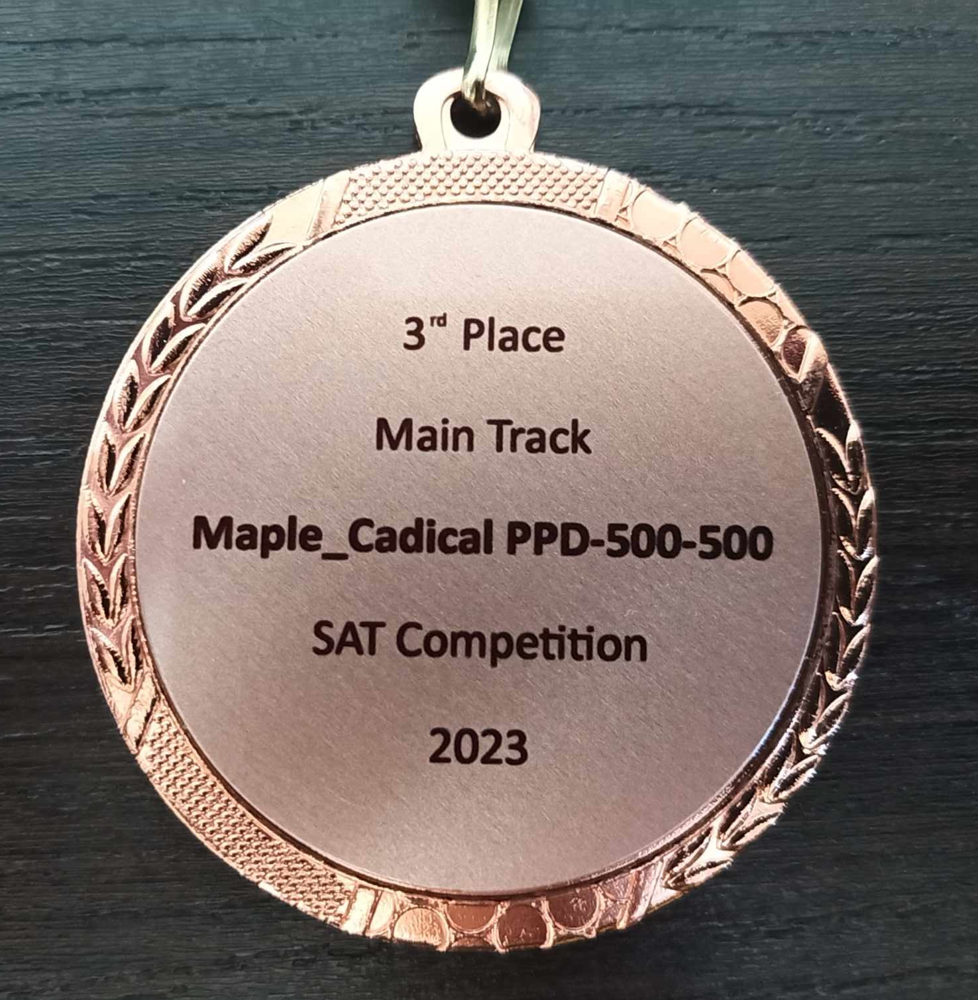
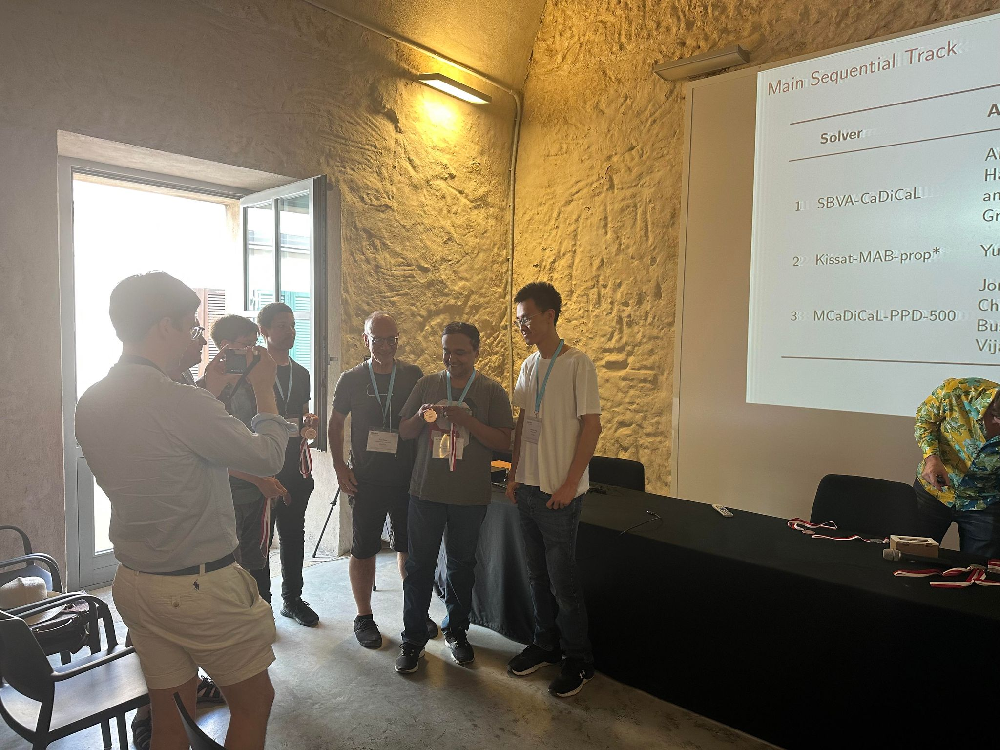
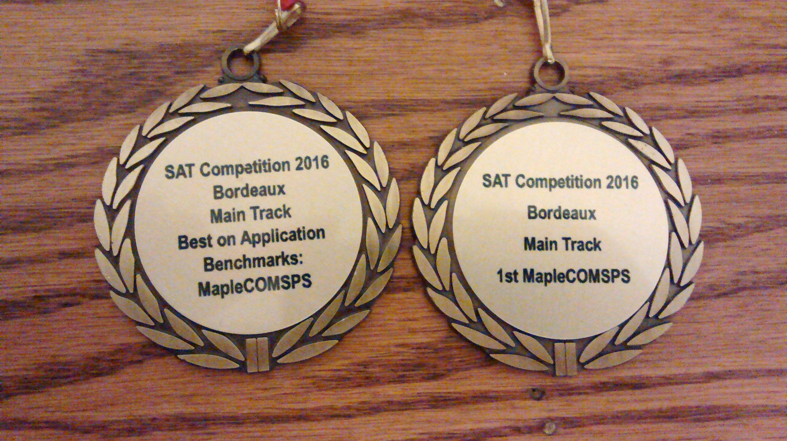


# MapleSAT: A Machine Learning based SAT Solver
The Maple series of SAT solvers is a family of  conflict-driven clause-learning SAT solvers outfitted with machine learning-based heuristics. Currently MapleSAT supports machine learning based branching and restarts policies. In the future, we plan to add a machine learning based clause learning policy.

A key innovation in the MapleSAT series of SAT solvers is the use of the **learning rate branching heuristic (LRB)**, a departure from the VSIDS branching heuristic that has been the status quo for the past decade of SAT solving. (Note that the experiments in our SAT 2016 paper describing LRB use only pure branching heuristics. That is, the VSIDS experiment uses only VSIDS and the LRB experiments uses only LRB. The hybrid LRB-VSIDS branching heuristic in MapleCOMSPS and MapleGlucose is only for the SAT competition and not part of the SAT 2016 paper.)



# News



* MapleCaDiCaL_PPD won 3rd in the [SAT Competition 2023](https://satcompetition.github.io/2023/downloads.html) Main track

* MapleSAT is now the default SAT solver used in the computer algebra system [Maple 2018](https://www.maplesoft.com/products/maple/new_features/maple2018/performance.aspx).
* MapleCOMSPS won 2nd in the [SAT Competition 2017](https://baldur.iti.kit.edu/sat-competition-2017/index.php?cat=results) Main track and No-limits track!
* MapleCOMSPS won 1st in the [SAT Competition 2016](http://baldur.iti.kit.edu/sat-competition-2016/index.php?cat=results) Main track and 2nd in the Application category!
* MapleCOMSPS_LRB won 1st in the [SAT Competition 2016](http://baldur.iti.kit.edu/sat-competition-2016/index.php?cat=results) Application category!



    

        {{ main-content | markdownify }}
    

    

        {{ news-panel-title | markdownify }}
        {{ news-panel | markdownify }}
    

<section class="main-content">
    <footer class="site-footer">
        This <a href="{{ site.github.owner_url }}/{{ site.github.repository_name }}">website</a> is maintained by the <a href="{{ site.github.owner_url }}">{{ site.github.owner_name }}</a> group.
        This page was generated by <a href="https://pages.github.com">GitHub Pages</a>.
    </footer>
</section>